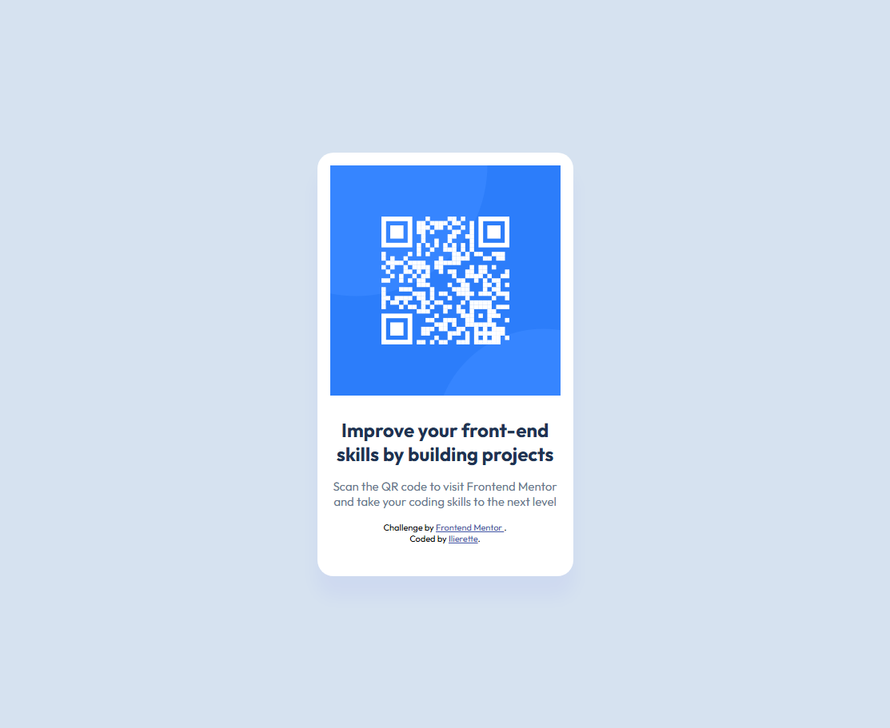

# Frontend Mentor - QR code component solution

This is a solution to the [QR code component challenge on Frontend Mentor](https://www.frontendmentor.io/challenges/qr-code-component-iux_sIO_H).

## Table of contents

- [Overview](#overview)
  - [Screenshot](#screenshot)
  - [Links](#links)
- [My process](#my-process)
  - [Built with](#built-with)
  - [What I learned](#what-i-learned)
  - [Useful resources](#useful-resources)

## Overview

### Screenshot

### Links

- Solution URL: [Add solution URL here](https://www.frontendmentor.io/solutions/qr-code-boQUAvAB4U)
- Live Site URL: [Add live site URL here](https://qr-code-card-taupe.vercel.app/)

## My process

### Built with

- Semantic HTML5 markup (or I hope)
- CSS custom properties
- Flexbox
- Mobile-first workflow

### What I learned

How to use figma, because I already know basics of html & css, flexbox, calc and responsive design. I needed reminder how to use rem.

### Useful resources

- [Różnica między jednostkami em i rem w CSS](https://clivio.pl/roznica-miedzy-jednostkami-em-i-rem-w-css/) - This helped me to understand, how rem works in CSS. I'm still unsure where I should use rem, em & px. But fonts are good place to start, because it's important for accessibility.
